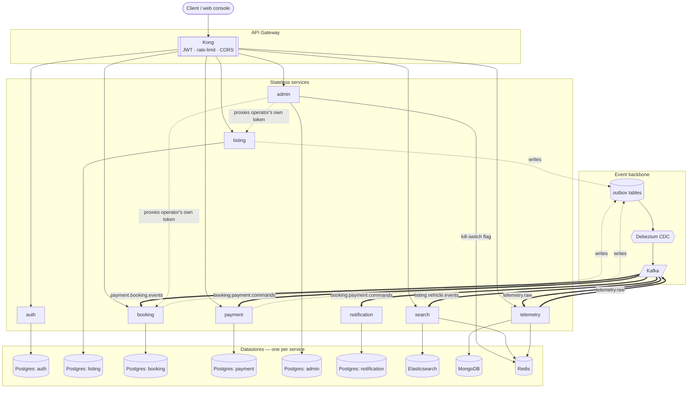

# CarFlow

Peer-to-peer car-sharing backend, built as a reference microservices project.
The point isn't rich business logic — the booking rules are deliberately
thin — it's the plumbing: event-driven services, CDC, sagas, observability,
and a real (if modestly-scaled) load test, not a diagram of one.

**Journey covered end-to-end:** register → host lists a car → admin approves
→ renter searches → books → payment hold → handover → active (telemetry
streams) → return → payment capture (+ mileage-overage fee if applicable).

## Stack

| Layer | Choice |
|---|---|
| Services | Python 3.12, FastAPI, fully async (SQLAlchemy async, asyncpg) |
| API gateway | Kong (JWT verification, rate limiting, CORS, request correlation) |
| Event bus | Kafka, via the **outbox pattern** + **Debezium CDC** — no service publishes to Kafka directly from request handlers |
| Datastores | Postgres (one database per transactional service), Elasticsearch (search read model), MongoDB (telemetry), Redis (cache/kill-switch) |
| Observability | OpenTelemetry (traces + metrics) → Jaeger + Prometheus + Grafana, wired from day one, not bolted on |
| Auth | JWT (HS256), issued by a dedicated auth service, verified at the gateway |
| Local runtime | docker-compose, 21 containers, one command |
| Deploy target | Kubernetes (Kustomize) on Hetzner Cloud — manifests and provisioning scripts written and validated; not yet run at production scale (see Results) |
| Load testing | Locust (HTTP) + a custom asyncio WebSocket generator (telemetry) |

**Services:** auth, listing, booking, payment, search, telemetry, admin,
notification — one concern each, one datastore each, no shared database.

## Architecture



Dotted arrows are the CDC path (a Postgres write, not a direct call); thick
arrows are Kafka topics — `booking` deliberately ships both its payment
commands and its own domain events onto the same topic
(`booking.payment.commands`), which is why it fans out to two consumers.
`admin` is a thin facade, not a second approval/booking state machine — it
forwards the operator's own JWT to `listing`/`booking` and only owns its
own audit log.

## Why it's built this way

- **Outbox + Debezium, not direct Kafka publishes.** A service writes its
  domain event to an `outbox` table in the *same transaction* as the state
  change; Debezium tails Postgres's WAL and ships it to Kafka. The event
  can never go missing because the transaction that created it committed
  but the Kafka publish didn't — there is no such window.
- **Idempotency everywhere it matters.** Every mutating endpoint takes an
  `Idempotency-Key` and replays the stored response on retry. Every Kafka
  consumer dedups via an `inbox` table keyed by `event_id`. The same
  command or event landing twice produces one effect, not two.
- **Booking is a saga, not a distributed transaction.** Booking → payment
  hold → confirm is coordinated through Kafka events with explicit
  compensation (payment failure → booking rolls back to rejected), never a
  2PC across services.
- **WebSockets for telemetry, HTTP for everything else.** Vehicle
  GPS/speed packets are frequent, small, and one-directional — a
  persistent WS connection avoids per-packet HTTP handshake overhead, and
  asyncio/uvicorn holds thousands of idle connections cheaply since it's
  I/O-bound, not one-thread-per-connection.
- **Never a shared database.** Each service owns its data; cross-service
  reads go through that service's API or its own projection (search's
  Elasticsearch index is a read model fed by listing's events, not a
  live join against listing's Postgres).

## Results

Two honestly different things, kept separate on purpose — a made-up
"handles 50k req/s" number is worth less than a real, small one plus the
math for the rest.

### Measured locally

Single Docker host (16GB RAM, one Kong instance), the full 21-container
stack, real traffic through real services — not a subset, not stubs.

**HTTP load** (Locust, 30 simulated users — 25 browsing/searching, 5
logging in and booking — 40s):

| Endpoint | Requests | Failures | Median | Notes |
|---|---|---|---|---|
| `POST /auth/login` | 5 | 0 | 2300ms | Argon2 hashing is deliberately slow — expected |
| `POST /booking/bookings` | 6 | 0 | 63ms | Triggers the full outbox→Debezium→Kafka→payment saga |
| `GET /search/vehicles` | 107 | 47 (all `429`) | 6ms | See finding below |

**Telemetry ingest** (20 simulated vehicles, WebSocket, target 1 packet/sec
each, staggered connection start): 18/20 connected, **1063 packets sent,
zero send/recv errors**, sustained rate ≈0.98 Hz/vehicle — matching the
1Hz target with no measurable degradation once connected.

**What actually capped this run — found, not guessed:** every failure was
a `429` from Kong's own rate-limiting plugin (`infra/kong.yml`: 60
requests/minute, shared across *all* routes for one client identity), 
confirmed from Locust's failure log, not assumed. Once a request or WS
handshake got past that limiter, it succeeded fast (single-digit-ms search
reads) and stayed reliable — the ceiling in this run was a deliberately
conservative gateway default doing its job on a single Kong instance, not
application code, Postgres, or Kafka running out of headroom. (A real
finding from this run also fixed a bug in the *test* itself: the original
Locust script hit `GET /bookings`, which is admin-only by design — a
renter reads their own booking via `GET /bookings/{id}`; fixed in
`deploy/loadtest/locustfile.py`.)

### Designed-for production capacity (not yet run)

Kubernetes on Hetzner is fully scripted (`deploy/`) but hasn't been run at
its target scale — that's a cost decision, not a technical blocker. What's
below is the sizing math behind that plan, not a benchmark result:

- **Kafka partitions:** every real topic ships with 1 partition by
  default (confirmed via `kafka-topics --describe` on the local stack) —
  scaling consumer replicas today buys zero parallelism. The deploy
  scripts create them with 6 partitions instead (verified safe: every
  producer keys by aggregate/vehicle id, so per-entity ordering holds).
- **Horizontal scaling:** booking and telemetry (the two paths under
  direct load) are configured with `HorizontalPodAutoscaler`s, 2→6
  replicas on CPU utilization.
- **Connection budget:** at max scale-out, pooled Postgres connections
  across all replicas sum to ~225 (SQLAlchemy defaults, unconfigured
  pool size) — Postgres is tuned to `max_connections=300` for the
  Hetzner deployment specifically because the stock default (100) would
  reject connections outright under that load, not just run slow.
- **Kong in that topology runs 2+ replicas** behind a NodePort; since its
  rate-limit policy (`local`) counts per replica independently, the
  effective ceiling that capped the local run above rises accordingly —
  a known, deliberate tradeoff, not an oversight.

## Repo layout

```
services/      one directory per service (own Dockerfile, migrations, tests)
shared/        cross-cutting: db session, outbox/inbox, JWT, OTel wiring
infra/         kong.yml, otel-collector config, Grafana dashboards, Debezium connectors
deploy/        Hetzner provisioning + Kubernetes manifests + load-test tooling
web/           a hand-rolled manual test console (not a product UI)
```

## Running it locally

```bash
docker compose up -d --build
# Kong:    http://localhost:8080
# Grafana: http://localhost:3000
# Jaeger:  http://localhost:16686
```
