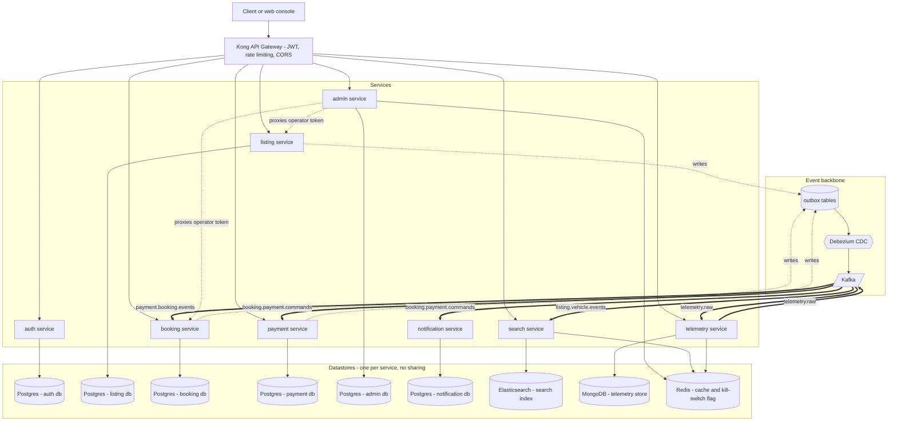

# CarFlow

Peer-to-peer car-sharing backend, built as a reference microservices project.
The point isn't rich business logic — the booking rules are deliberately
thin — it's the plumbing: event-driven services, CDC, sagas, observability,
and a real (if modestly-scaled) load test, not a diagram of one.

**Journey covered end-to-end:** register → host lists a car → admin approves
→ renter searches → books → payment hold → handover → active (telemetry
streams) → return → payment capture (+ mileage-overage fee if applicable).

## Stack

| Layer | Choice |
|---|---|
| Services | Python 3.12, FastAPI, async (SQLAlchemy, asyncpg) |
| API gateway | Kong — JWT, rate limiting, CORS |
| Event bus | Kafka, via outbox pattern + Debezium CDC |
| Postgres | one database per transactional service |
| Elasticsearch | search read model |
| MongoDB | telemetry store |
| Redis | cache + kill-switch flag |
| Observability | OpenTelemetry → Jaeger + Prometheus + Grafana |
| Auth | JWT (HS256) |
| Local runtime | docker-compose, 21 containers |
| Deploy target | Kubernetes (Kustomize) on Hetzner — scripted, not yet run at scale |
| Load testing | Locust + a custom asyncio WebSocket generator (telemetry) |

**Services:** auth, listing, booking, payment, search, telemetry, admin,
notification — one concern each, one datastore each, no shared database.

## Architecture



Dotted arrows are the CDC path (a Postgres write, not a direct call); thick
arrows are Kafka topics — `booking` deliberately ships both its payment
commands and its own domain events onto the same topic
(`booking.payment.commands`), which is why it fans out to two consumers.
`admin` is a thin facade, not a second approval/booking state machine — it
forwards the operator's own JWT to `listing`/`booking` and only owns its
own audit log.

## Why it's built this way

- **Outbox + Debezium, not direct Kafka publishes.** A service writes its
  domain event to an `outbox` table in the *same transaction* as the state
  change; Debezium tails Postgres's WAL and ships it to Kafka. The event
  can never go missing because the transaction that created it committed
  but the Kafka publish didn't — there is no such window.
- **Idempotency everywhere it matters.** Every mutating endpoint takes an
  `Idempotency-Key` and replays the stored response on retry. Every Kafka
  consumer dedups via an `inbox` table keyed by `event_id`. The same
  command or event landing twice produces one effect, not two.
- **Booking is a saga, not a distributed transaction.** Booking → payment
  hold → confirm is coordinated through Kafka events with explicit
  compensation (payment failure → booking rolls back to rejected), never a
  2PC across services.
- **WebSockets for telemetry, HTTP for everything else.** Vehicle
  GPS/speed packets are frequent, small, and one-directional — a
  persistent WS connection avoids per-packet HTTP handshake overhead, and
  asyncio/uvicorn holds thousands of idle connections cheaply since it's
  I/O-bound, not one-thread-per-connection.
- **Never a shared database.** Each service owns its data; cross-service
  reads go through that service's API or its own projection (search's
  Elasticsearch index is a read model fed by listing's events, not a
  live join against listing's Postgres).

## Results

Real numbers, kept separate from production sizing math — no fabricated
benchmark.

### Measured locally

16GB Docker host, full 21-container stack, real traffic.

| Endpoint | Requests | Failures | Median |
|---|---|---|---|
| `POST /auth/login` | 5 | 0 | 2300ms (argon2, expected) |
| `POST /booking/bookings` | 6 | 0 | 63ms |
| `GET /search/vehicles` | 107 | 47 (`429`) | 6ms |

Telemetry: 18/20 WS connected, 1063 packets, 0 errors, ~0.98 Hz/vehicle
(target 1Hz).

**Bottleneck, found not guessed:** every failure was Kong's rate limit
(60/min, shared across routes) — confirmed in the failure log. Past that
limit, everything was fast and clean. Also caught a bug in the test itself
(it hit an admin-only endpoint) — fixed in `deploy/loadtest/locustfile.py`.

### Production capacity (designed, not yet run)

K8s/Hetzner is scripted (`deploy/`) but not run at scale — a cost call, not
a technical blocker.

- Kafka topics: 1 partition measured locally → bumped to 6 for the deploy (producers key by entity, so this is safe).
- Booking/telemetry: HPA 2→6 replicas.
- Postgres: tuned to 300 max connections (stock 100 would reject at max scale-out).

## Running it locally

```bash
docker compose up -d --build
```
Kong `:8080`, Grafana `:3000`, Jaeger `:16686`.
